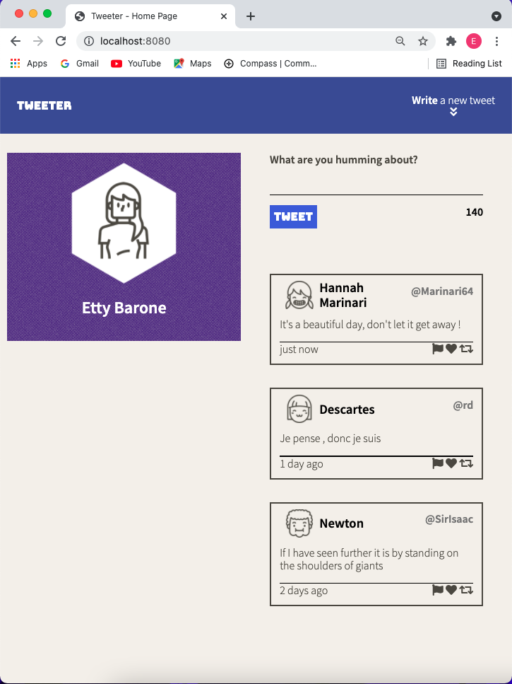
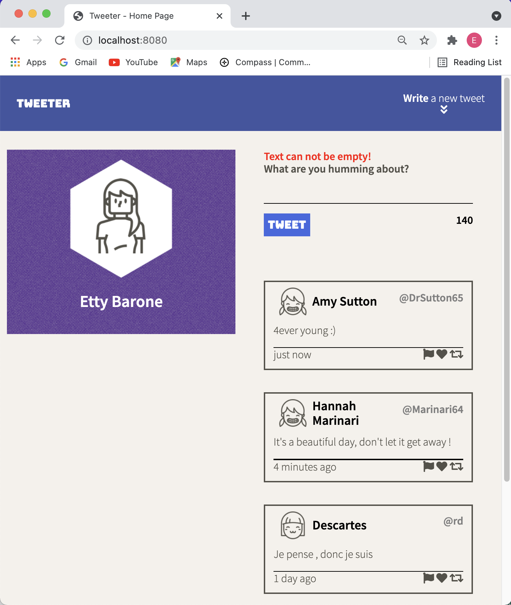
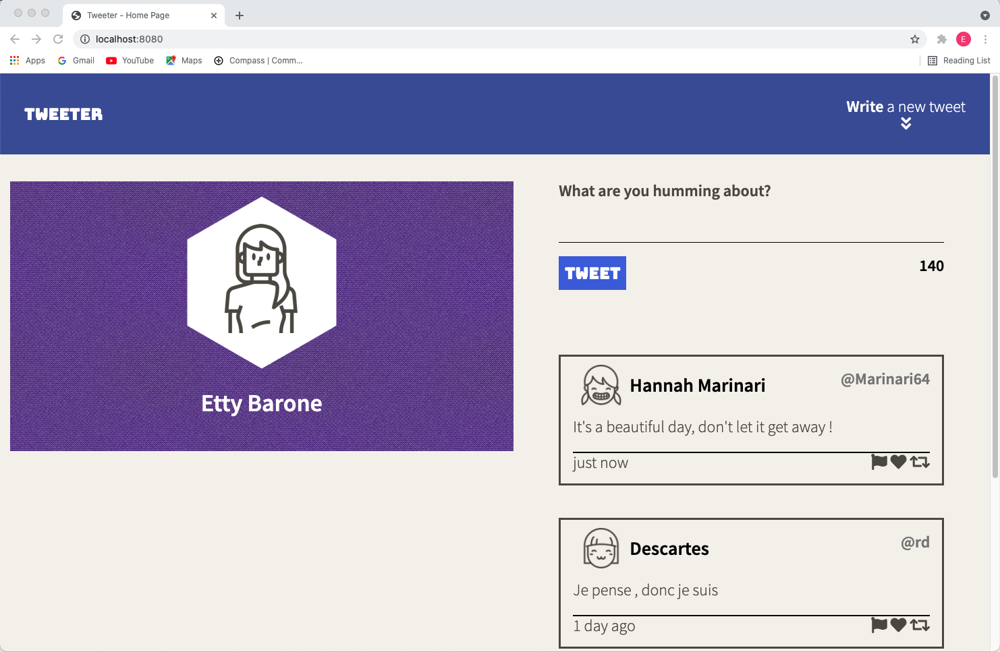
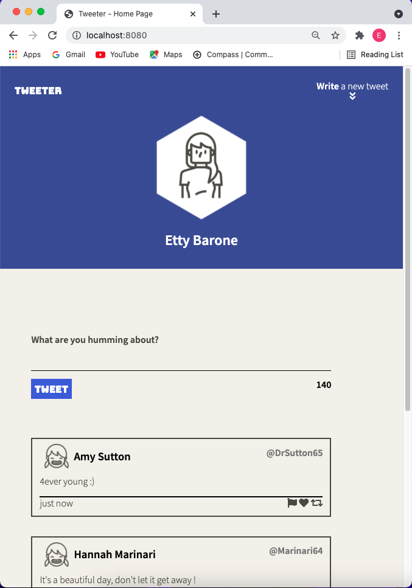

# Tweeter Project

Tweeter is a simple, single-page Twitter clone.
Tweeter allows posting tweets 140 characters long and presenting all the existing tweets in a reversed order.
The app showes an avatar, the user's name, the user's handel, the tweet and the date it was posted.
There are two different designs which will be decided according screen size - 1024px is the breakpoint.

## Getting Started

1. Fork this repository, then clone your fork of this repository.
2. Install dependencies using the `npm install` command.
3. Start the web server using the `npm run local` command. The app will be served at <http://localhost:8080/>.
4. Go to <http://localhost:8080/> in your browser.

## Dependencies

- Express
- Node 5.10.x or above
- body-parser
- chance

## Screenshots

